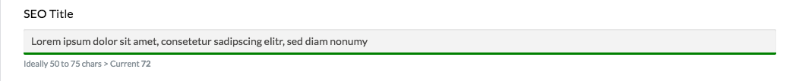

# Statamic Char counting field 

A input field or textarea which shows the status of the length
with colored feedback on the input element.

## Configuration

| Option        | Description                            |
|---------------|----------------------------------------|
| `input_type`  | Choose between input or textarea       |
| `min`         | Minimal length                         |
| `max`         | Maximal length                         |
| `optimal_min` | Optional min length for optimal result |
| `optimal_max` | Optional max length for optimal result |
| `hard_limit`  | Maxlength for input field              |

 - If the length is outside of min and max the color is **red**.
 - If the length is between min and max but not between the optimal length **orange**
 - If the length is in the optional range or between min and max if no optimal length is provided the color is **green**

### Known problems

The fieldtype options are not correctly displayed (`fieldtypes/char_field.input_type`), follow [#1084](https://github.com/statamic/v2-hub/issues/1084)

Prior statamic 2.1.18 the translations inside the vue.js did not work because of [#1064](https://github.com/statamic/v2-hub/issues/1064)
